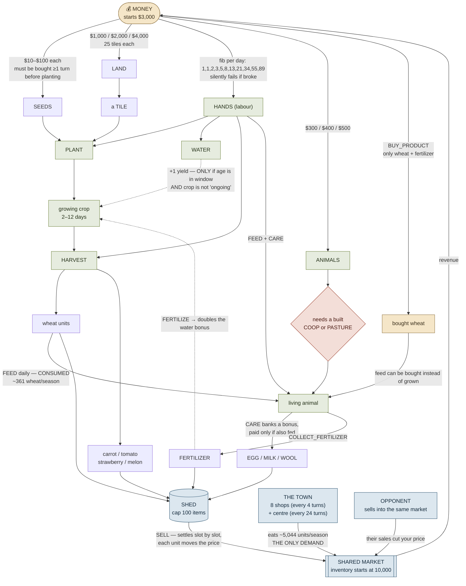
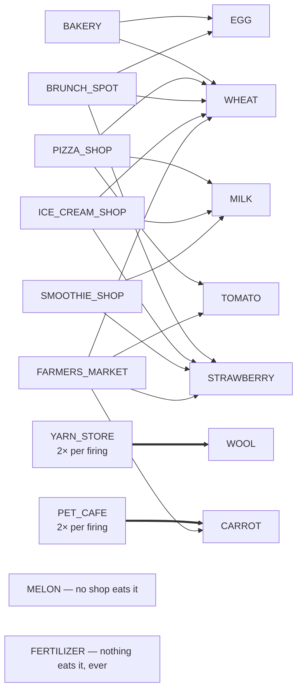

# Kaggriculture — the whole economy on one page

Every resource, what it needs, what it costs, how long it takes, and where the demand comes from.
All numbers pulled directly from the engine source, not remembered.

---

## 1. The dependency graph

---

## 2. Crops — cost, time, yield

| crop | seed | first yield | full yield at | max units | keeps producing? | water adds yield? |
|---|---|---|---|---|---|---|
| WHEAT | $10 | day 2 | **day 4** | **6** | no | ✅ yes |
| CARROT | $20 | day 2 | **day 3** | 4 | no | ✅ yes |
| MELON | $80 | day 10 | **day 12** | **6** | no | ✅ yes |
| TOMATO | $50 | day 8 | day 8 | 4 | **yes, every 1 day** | ❌ **no** |
| STRAWBERRY | $100 | day 10 | day 10 | 4 | **yes, every 2 days** | ❌ **no** |

Watering only adds yield when `(full_yield_day+1)//2 ≤ age ≤ full_yield_day` — **and only for
non-`ongoing` crops**. Fertilizing doubles that bonus. So strawberry and tomato gain *nothing* from
water except weed prevention.

## 3. Animals — cost, time, output

| animal | cost | needs | first yield | then every | holds | product |
|---|---|---|---|---|---|---|
| GOOSE | $300 | COOP | day 4 | 1 day | 4 | EGG |
| COW | $400 | PASTURE | day 8 | 2 days | 6 | MILK |
| SHEEP | $500 | PASTURE | day 6 | 3 days | 6 | WOOL |

All animals must be **FED daily** (1 wheat each) or they starve. COW and SHEEP share the same
PASTURE, so swapping between them is structurally free.

## 4. Demand and price sensitivity — the heart of it

| product | base $ | **surplus to HALVE** | who eats it | our revenue |
|---|---|---|---|---|
| MELON | 250 | 112 | **NO SHOP** — town centre only (30/season) | $15,102 |
| WOOL | 200 | **42** | YARN_STORE only (**2× per firing**) | $7k–64k ⚠ |
| MILK | 160 | **38** | PIZZA, ICE_CREAM, SMOOTHIE | $15k–76k ⚠ |
| STRAWBERRY | 120 | **31** | BRUNCH, ICE_CREAM, SMOOTHIE, FARMERS_MKT | $32k–96k ⚠ |
| FERTILIZER | 100 | 248 | **NOBODY** — no shop, not in town centre | $16,995 |
| TOMATO | 60 | 135 | PIZZA, FARMERS_MKT | $0 (we grow none) |
| EGG | 50 | >4000 | BAKERY, BRUNCH | $0 (we keep no geese) |
| CARROT | 35 | 230 | PET_CAFE (**2×**), FARMERS_MKT | $924 |
| WHEAT | 25 | >4000 | BAKERY, PIZZA, BRUNCH, ICE_CREAM, FARMERS_MKT | $16,211 |

⚠ = the revenue swings hugely by seed, entirely depending on **which shops unlocked**.

**Demand arithmetic:** the town centre eats 1 of each of 8 products every 24 turns (30×/game).
One shop eats 1 of each product it carries every 4 turns (up to 180×/game), **doubled** for a
single-product shop. Eight shops fire **936 times** a game against the centre's 30 — so shops
are essentially all of the demand, and which ones unlock is the biggest random factor in the game.

---

## 5. The constraints that are easy to miss

These are all measured, and each one killed an idea that looked good on paper.

| constraint | consequence |
|---|---|
| **Wheat is feed, not a crop.** ~361 wheat/season is eaten by animals producing $50k of milk+wool. | Cutting wheat to plant something better starves the animals. Cost of trying: **−5,876**. |
| **Watering adds nothing to ongoing crops.** | 104 of our 143 "missed" in-window waterings are strawberry — worth $0. |
| **Fertilizer is an input, not just a product.** FERTILIZE doubles the water bonus. | Dumping it for cash costs **−2,092**. |
| **The opening is a tuned cash schedule.** $2,830 of $3,000 spent on day 0; runs on a $0–9 minimum. | One extra **$50** purchase costs **−13,836** (starves a HIRE → death spiral). Deferring a purchase costs **−119,077**. |
| **Seeds resolve after unit actions.** | A seed bought this turn cannot be planted until next turn. |
| **Planting is atomic per crop.** If a turn needs more seed of a crop than you hold, **every** planting of that crop that turn is dropped. | |
| **Orders settle slot by slot**, our order #1 vs their order #1, each unit moving the price. | Selling from an earlier slot is worth real money — our best edge (+3,474). |
| **The market is a prisoner's dilemma.** 31–42 surplus units halves the top products. | Both would earn more selling slowly, but selling slowly while they dump costs **−103,111**. Dumping first is dominant. |

---

## 6. Where our allocation differs from #1

| | us | keiz (#1) | Jesse (#2) | Crop Dusta |
|---|---|---|---|---|
| plant WHEAT | **194** | **119** | 174 | 131 |
| plant CARROT | **9** | **42** | 23 | 34 |
| plant TOMATO | 0 | 9 | 0 | 3 |
| buy GOOSE | 0 | 1 | 0 | 2 |
| idle turns (PASS) | 560 | 244 | 574 | 341 |
| land bought on days | 6/11 | 6/11 | 6/11 | 5/8 |
| mean bank | 88,606 | **95,923** | 92,607 | ~89,000 |

keiz performs **fewer** productive actions than us and banks more. Land timing is identical for
everyone. The whole difference is the crop mix — and they re-decide it each game based on which
shops unlocked (they branch at days 0, 6, 7, 8, 11; we branch once, at day 15).

---

## 7. Reading the losses as edge cases

Framed the way you suggested — not "our farm is worse", but "which situations is the opponent
prepared for that we aren't". Everything above says the answer is one situation:

> **The shop draw decides which product is worth growing, and we always grow the same thing.**

When the draw suits our fixed mix we win comfortably. When it doesn't — a YARN_STORE-heavy draw when
we're wool-light, two PET_CAFEs when we plant 9 carrot — we lose, and the loss looks like a
"close game we should have won". Our margin swings **+659 with YARN_STORE, +377 with BRUNCH_SPOT,
+236 with PET_CAFE**, so the draw is worth well over a thousand dollars of margin by itself.

That reframes the target usefully: we don't need keiz's whole plan. We need to stop losing the
specific draws we're mismatched against — which is a much smaller problem than rebuilding the farm.
